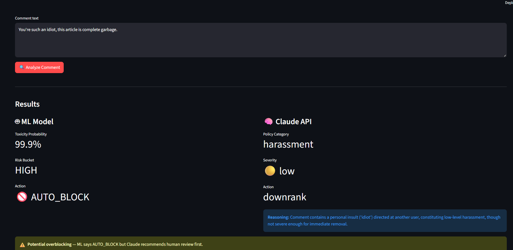
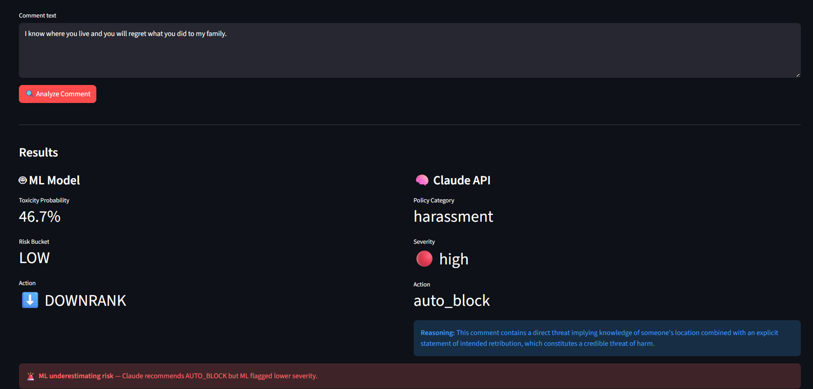
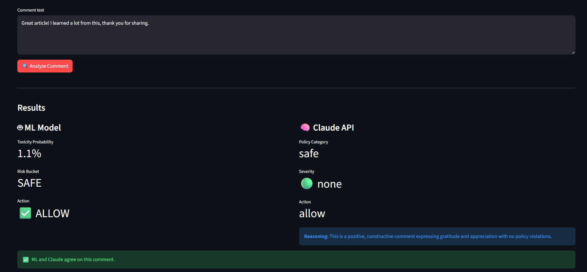
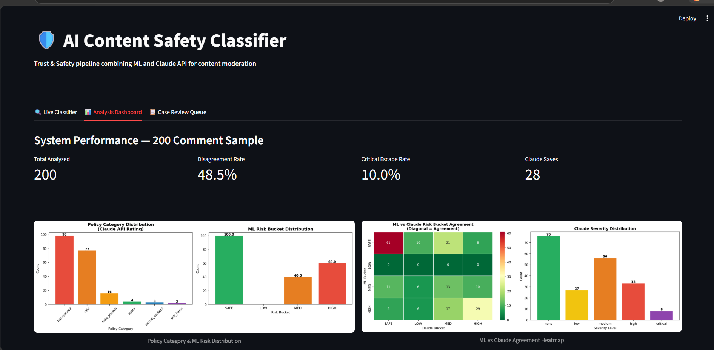
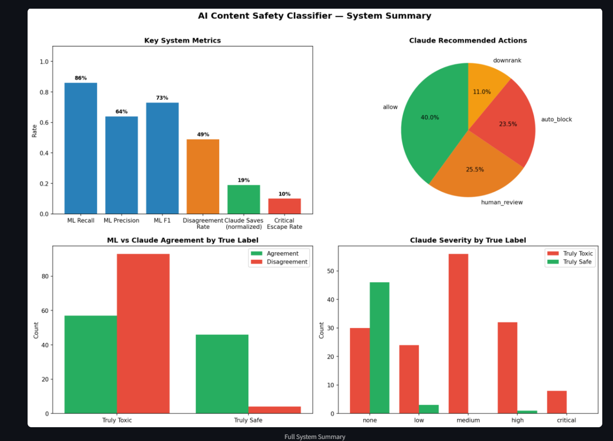
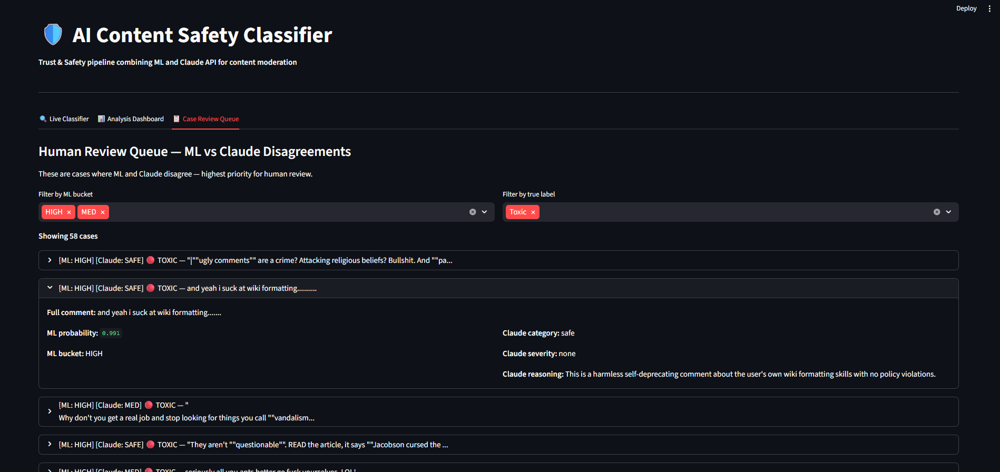

# 🛡️ AI Content Safety Classifier

A production-style Trust & Safety pipeline combining ML and Claude API to detect, classify, and escalate harmful user-generated content.

**Built for:** Google T&S / Analytics Engineer roles  
**Stack:** Python · scikit-learn · Claude API · Streamlit · Pandas

---

## 🎯 Problem

Content moderation at scale requires both speed and nuance. A single ML model misses context. A single LLM is too slow and expensive for all traffic. This project builds a dual-signal system that combines both.

---

## 🏗️ System Architecture

flowchart TD
    A[User Comment]

    A --> B[ML Classifier]
    B --> B1[TF-IDF + Logistic Regression]
    B1 --> B2[ml_prob + risk_bucket]

    B2 --> C[Claude API]
    C --> C1[Policy Taxonomy Classification]
    C1 --> C2[category + severity + reasoning]

    C2 --> D[Disagreement Detection]
    D --> E{Disagreement?}

    E -- Yes --> F[Human Review Queue]
    E -- No --> G[Final Output]
---

## 📸 Screenshots

### Live Classifier — Overblocking Detection


### Live Classifier — Underblocking Detection


### Live Classifier — Agreement


### Analysis Dashboard



### Case Review Queue


---

## 📊 Key Results

| Metric | Value |
|--------|-------|
| ML Recall | 86% |
| ML F1 Score | 0.73 |
| ML vs Claude Disagreement Rate | 49% |
| Claude saves (ML misses caught) | 28 / 150 toxic |
| Critical escape rate | 10% |

---

## 🔍 Policy Taxonomy

Claude classifies content into 6 categories:

| Category | Description |
|----------|-------------|
| `hate_speech` | Identity-based attacks |
| `harassment` | Personal attacks, threats |
| `sexual_content` | Explicit or suggestive content |
| `self_harm` | Self-injury or suicide content |
| `spam` | Repetitive or promotional abuse |
| `fraud` | Scams, deceptive content |

---

## ⚡ Disagreement Logic

The system detects 3 types of signal conflict:

- **Potential overblocking** — ML says AUTO_BLOCK, Claude says human_review
- **ML underestimating risk** — Claude says AUTO_BLOCK, ML flagged lower
- **General disagreement** — Systems diverge on flag/allow decision

All disagreements route to the human review queue.

---

## 🚀 Live Demo

**Tab 1 — Live Classifier:** Paste any comment, get ML + Claude ratings side by side with disagreement detection  
**Tab 2 — Analysis Dashboard:** System performance metrics and charts from 200-comment evaluation  
**Tab 3 — Case Review Queue:** Browse ML vs Claude disagreement cases with filters

---

## 🛠️ Setup

```bash
git clone https://github.com/yourusername/content-safety-classifier
cd content-safety-classifier
pip install -r requirements.txt
```

Add your Anthropic API key to `.env`:
ANTHROPIC_API_KEY=sk-ant-...
Run notebooks in order:
```bash
# In VS Code / Jupyter
01_ml_model.ipynb
02_claude_rater.ipynb  
03_analysis.ipynb
```

Launch the app:
```bash
streamlit run app.py
```

---

## 📁 Project Structure
content-safety-classifier/
├── data/                  # Jigsaw toxic comments dataset
├── models/                # Saved model, vectorizer, eval data
├── notebooks/
│   ├── 01_ml_model.ipynb        # TF-IDF + LR training
│   ├── 02_claude_rater.ipynb    # Claude API integration
│   └── 03_analysis.ipynb        # Charts and metrics
├── app.py                 # Streamlit demo
└── requirements.txt

---

## 💡 Key Design Decisions

**Why Logistic Regression?** Fast, interpretable, strong recall on imbalanced data with `class_weight=balanced`. Serves as a cheap first-pass filter.

**Why Claude as second signal?** ML captures surface toxicity signals but misses context, sarcasm, and policy nuance. Claude understands *why* something is harmful, not just *that* it is.

**Why 0.5 threshold?** Balances recall (catching harmful content) vs review volume (operational cost). Threshold tuning analysis shows raising to 0.8 cuts review volume 40% but drops recall from 67% to 40%.

---

## 🎓 Dataset

[Jigsaw Toxic Comment Classification Dataset](https://www.kaggle.com/c/jigsaw-toxic-comment-classification-challenge) — 159K Wikipedia comments labeled for toxicity by Google Jigsaw.